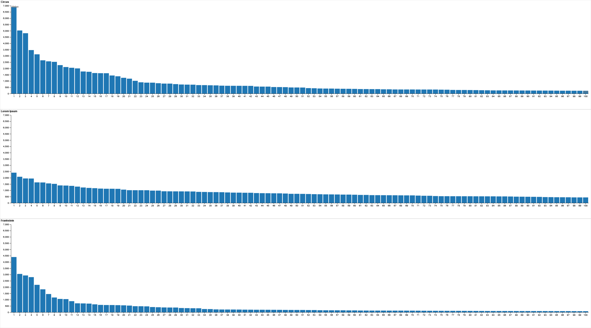

<h1 style="text-align: center; margin: 0;  padding: 25px; line-height: 65px;" > Cracking the Code on Artificial Language

*The use of the Zipf's Law on Unkown texts*

</h1>

By Tam Harris   Student Number:6767461   IASC 2P02   Professor Mauro   April-14-2023

<pagebreak>

>

## Abstract

The purpose of this paper is to use Zipf's Law to analyze the legitimacy of untranslated texts. As researchers continue to decipher mysterious works such as the *Voynich manuscript* the ability to tell if the work is real or merely a hoax becomes ever more essential. By applying the law to two control groups and the subject, it hopes to prove the power of Zipf’s Law in identifying the difference between a natural language and randomized language. The overall findings suggest a strong link between Zipf’s Law and natural languages, but the entirely randomized set did not completely break from the pattern, suggesting that further research into this topic is required. 

#

##  Introduction

Language, something we humans use everyday with one another, an idea that exists globally even if the words and how they are spoken vary heavily. Written systems aren’t free of this variety; pictograms, alphabets, scripts, and knots have all been ways that humans have recorded information. This variety has caused some issues with scholars in the modern day. With so many lost languages, how can they tell if recorded work is written in a lost language or merely gibberish? Thankfully, all of these works have something in common that should allow us to be able to identify if what is written is a language or gibberish, or otherwise whether an intelligent life made it. Actor Network theory suggests that human beings are influenced just as much by what is happening within our environment as by one another, and so too is the language. Like water traveling down an existing slope, language follows the path of least resistance  (Latour 1996). It is easier to convey meaning to one another if we have generalized words that lead into specialized words rather than a large number of specialized words. This habit of having a large amount of generalized words has caused languages to follow Zipf’s Law, where the most common word will be twice as likely as the second and three times as likely of the third, all the way down. Since all languages seem to follow this pattern, even ones we have been unable to translate, we should be able to see if a written text is a language or not by how closely it follows Zipf’s (Law, 2008). This study will aim to test this theory on a randomly generated language to see if Zipf’s Law can truly be an indicator on if it is a language or not. 

#

## Method 

To best simulate the look and structure of a possible language, Lorem Ipsum was used as the stand-in for the unknown text. Lorem Ipsum is a corrupted form of Latin commonly used for filler text when developing websites or other software applications (Adams, 2001). The word structure being pseudo-randomly-generated while working off a preexisting, if corrupted, lexicon is the perfect stand-in for a work of text that has been forged or merely is not a language. Nine hundred paragraphs of Lorem Ipsum were randomly generated for this experiment, simulating the size of a short story or damaged literary work. As a control, the English text *Frankenstein* by Mary Shelley and the French text *Artamene ou le Grand Cyrus* by Georges de Scudéry were used. The two languages acted as a control to show how Zipf’s Law affects multiple languages. All three texts were fed into Voyant to count how many times a word appeared in the text. Due to the varying sizes between the texts only the first hundred highest ranking words were selected as a way to avoid hyper specialized words within each work that could muddy the data.  Then, the standard distribution of each has been compared and contrasted. 

<iframe style='width: 477px; height: 398px;' src='https://voyant-tools.org/tool/CorpusTerms/?corpus=88d592224c2ebd93af0d012298f40509'></iframe>

Lorem Ipsum Corpus 

  

<iframe style='width: 477px; height: 395px; ' src='https://voyant-tools.org/tool/CorpusTerms/?stopList=keywords-4fc3ea894c10b52e3abd1b092b355114&corpus=1490a80554b4726c3ddad33bb2286334'></iframe>

Artamene ou le Grand Cyrus Corpus 

  

<iframe style='width: 477px; height: 395px;' src='https://voyant-tools.org/tool/CorpusTerms/?stopList=keywords-091f0a24b79789c2179960db18e019ec&corpus=frank'></iframe>

Frankenstein Corpus 

## Results 

</img>

The general pattern of all three groups are similar patterns of distribution with a spike at the beginning and then tapering off. However, the two control groups followed Zipf's Law more closely with a larger spike compared to the Lorem Ipsum group and a steeper falloff of word use. This can also be seen in the controls’ much lower trend percentage value, with the words in the bottom of the rankings being used significantly less;  *Frankenstein*’s has the lowest overall trend value was *again* showing up  0.01076509% of the time, *Artamene ou Le Grand Cyrus* lowest trend value was *rein* at 0.01415864%, and Lorem Ipsum had a much higher rate of 0.43454105%. Lorem Ipsum’s least used word was comparable to Frankenstein’s 30th ranked word. An interesting result is how heavily the *Frankenstein* word use dropped off, the word *again* appeared only 84 times within the entire narrative, compared to *the* which appears a total of 4398, *the* is 52.35 times as likely to appear as the lowest ranked word. In contrast *de* is only 30.92 times as likely as *reim* the lowest word in *Artamene ou Le Grand Cyrus*. Lorem Ipsum has the smallest gap with the difference between the most and least used word being only 5.5 times. This stark difference between the control groups and the subject shows that applying Zipf's law to unknown texts has merit. 

## Discussion

One of the main goals of the Digital Humanities is to help categorize and archive the humanities as well as working within the established framework to better our understanding of the (Kirschenbaum, 2012)m. To this end, the results are promising. Even if not entirely conclusive, the real texts followed Zipf's Law more accurately, but the fake one didn’t entirely buck the trend. This could be due to how common the distribution is in the natural world, making the application somewhat limiting. It wouldn’t be reasonable to think that if a signal followed Zipf’s Law, it was a communication, but a long lost work coming up that didn’t follow Zipf’s Law should be inspected more closely to check its legitimacy. Further study should be done on a wider range of mediums, such as radio, to see if this method can be applied for filtering out a message from background emissions. Lastly, it can be applied closer to home on works that are suspected to be hoaxes, such as the Voynich manuscript, a piece of written work that some believe to be fake due to remaining untranslated into the modern day. It is the job of those within the digital humanities to persevere and understand the works of the past to stop them from going extinct, so knowing if a work is legitimate or not will go a long way towards allowing those working to focus their efforts on what truly needs preserving(Nowviskie, 2015).

#

<h2 style="text-align: center; margin: 0;"> References </h2>

Adams, C. (2001, February 16). What does the filler text "lorem ipsum" mean? The Straight Dope. Retrieved April 18, 2023, from https://www.straightdope.com/21343427/what-does-the-filler-text-lorem-ipsum-mean

  Latour, B. (1996). On actor-network theory: A few clarifications. Soziale Welt, 47(4), 369–381.

  Matthew Kirschenbaum. (2012). What Is Digital Humanities and What’s It Doing in English Departments? In Debates in the Digital Humanities (NED - New edition, p. 3–). University of Minnesota Press. https://doi.org/10.5749/j.ctttv8hq.4

  Nowviskie, B. (2015). Digital Humanities in the Anthropocene. Digital Scholarship in the Humanities, 30(suppl 1), i4–i15. https://doi.org/10.1093/llc/fqv015

  Smith, R. D. (2008). Investigation of the Zipf-plot of the extinct Meroitic language. https://doi.org/10.48550/arxiv.0808.2904

